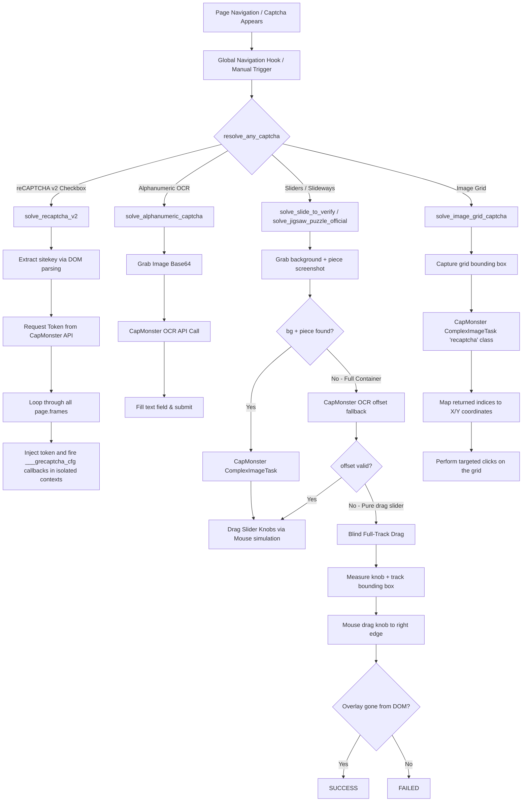

# Playwright E-Commerce Captcha Solver

A high-performance, robust CAPTCHA resolution system designed specifically to bypass modern bot-detection and verification walls (e.g., Lazada, Alibaba, Taobao) within a Playwright-driven Python automation browser.

---

## Features

### 1. Frame-Aware reCAPTCHA v2 Solver
* **Cross-Origin Iframe Targeting**: Iterates through all nested frames (`page.frames`) to find the isolated iframe where the reCAPTCHA widget lives (e.g., `baxia.taobao.com`).
* **Token Injection & Dispatching**: Injects the resolved CapMonster token directly into standard hidden textareas (`g-recaptcha-response`) inside the correct iframe's DOM.
* **Framework Events**: Dispatches simulated standard browser events (`input`, `change`) on inputs so that frontend frameworks (React, Vue, Angular) register the value changes.
* **Automatic Callback Triggering**: Evaluates the global `window.___grecaptcha_cfg` configuration object inside the correct context and automatically fires the corresponding callbacks.

### 2. Jigsaw Puzzle Slider Solver
* **Coordinate Extraction**: Identifies and screenshots the background and slide piece elements, converting them to Base64 payloads.
* **CapMonster ComplexImageTask**: Submits both images to the CapMonster API to receive precise alignment coordinates.
* **Human-like Drag Actions**: Uses Playwright mouse movement tools to simulate linear/curved speed offsets and click-and-drag mechanics to simulate natural interaction.

### 3. Slide-to-Verify (Alibaba/Lazada NoCaptcha)
* **Single Container Captures**: Screenshots full slider wrappers when separate background/piece components are missing, using CapMonster OCR to estimate pixel offsets.
* **Fallback Mechanisms**: Automatically falls back to traditional coordinate estimations and sliding.
* **Blind Full-Track Drag** *(new)*: When no background or piece image exists — as with Lazada's "Please slide to verify" modal — the solver skips CapMonster entirely and performs a full-width mouse drag directly on the track. It measures the knob and track bounding boxes via Playwright, then executes a slow human-like drag to the far-right end. The overlay disappearing from the DOM is used as success confirmation.
* **Enhanced Detection**: The trigger selector list now includes `[class*='verify-dialog']`, `[class*='baxia-dialog']`, and `div:has-text('Please slide to verify')` to catch the specific Lazada "unusual traffic" popup.

### 4. Image Grid Captcha ("Select all squares with...")
* **Heuristic Object Detection**: Dynamically locates the image grid challenge by matching selector keywords and visual sizes. 
* **Coordinate Mapping**: Takes CapMonster's `ComplexImageTask` array indices and dynamically calculates bounding box coordinates to accurately click individual grid tiles or canvas regions without being hindered by iframe drifting.

### 5. Alphanumeric OCR Captcha
* **Multi-Selector Image Detection**: Recognizes dynamic captcha images and input fields using heuristic DOM scanning.
* **SDK & Raw HTTP Parallel Integration**: Utilizes the `capmonster_python` SDK client with automatic fallback to direct HTTP post-requests to guarantee API responsiveness.
* **Automated Failure Refresh**: Clears inputs, submits, evaluates success, and auto-refreshes/retries on incorrect guesses (up to configurable retries limit).

---

## Configuration

Add your CapMonster Cloud API key inside the `.env` file at the project root:

```ini
CAPMONSTER_CLOUD=your_capmonster_api_key_here
```

---

## Usage

### Direct Solver Calls
You can trigger specialized solvers directly inside your automation script:

```python
from playwright.sync_api import sync_playwright
from captcha_solver import solve_recaptcha_v2, solve_alphanumeric_captcha

with sync_playwright() as p:
    browser = p.chromium.launch(headless=False)
    page = browser.new_page()
    page.goto("https://example.com/login")
    
    # Solve any standard reCAPTCHA present on the page
    success = solve_recaptcha_v2(page)
    if success:
        print("reCAPTCHA bypassed successfully.")
```

### Master Orchestrator (Automatic Multi-Captcha Resolution)
Use `resolve_any_captcha` to scan and resolve any known captcha pattern sequentially (OCR, reCAPTCHA, sliders/jigsaws, and image grids):

```python
from captcha_solver import resolve_any_captcha

# Scans the active page and attempts solving up to 3 rounds of challenges
# Resolution order: image-grid → reCAPTCHA v2 → OCR → jigsaw → slide-to-verify (with blind drag fallback)
resolved = resolve_any_captcha(page, max_rounds=3)
```

### Global Captcha Interceptor Hook
Attach a non-blocking hook to automatically run the master orchestrator every time a new page or navigation load is triggered:

```python
from captcha_solver import attach_global_captcha_hook

# Hook auto-attaches to the page lifecycle
attach_global_captcha_hook(page)

# Subsequent navigations will now auto-bypass captcha walls on load
page.goto("https://www.lazada.sg/")
```

---

## Technical Architecture

