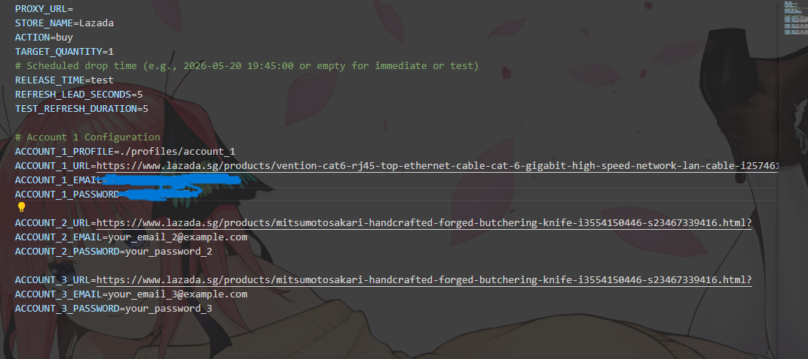
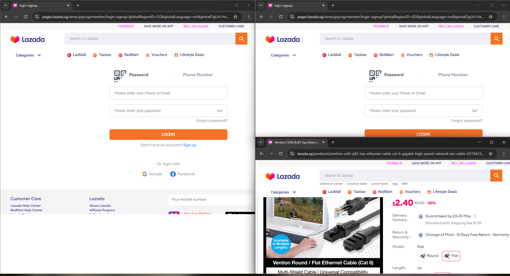

# E-Commerce Snipe Bot - User Guide

Welcome! This guide will walk you through setting up and using the shopping bot. Everything is explained in plain language with detailed explanations of what each step does.

## What This Bot Does

This bot automatically monitors products on e-commerce websites (currently Lazada) and can:
- Watch for when a product comes back in stock
- Automatically buy the product the moment it's available
- Run multiple accounts at the same time to increase your chances
- Start at a specific time (useful for scheduled product releases)

Think of it as having a super-fast assistant that never blinks, constantly refreshing the product page and clicking "Buy Now" the instant the item is available.

---

## What You Need Before Starting

- **VSCode installed** - You already have this and know how to use it
- **Python installed** - A programming language that runs the bot (we'll check this)
- **Internet connection** - To access the shopping websites
- **Account credentials** - Your email and password for the shopping site

---

## Step 1: Check if Python is Installed

Python is the "engine" that runs this bot. Let's check if you have it:

### Open VSCode Terminal

1. Open this project folder in VSCode
2. At the top menu, click **Terminal** → **New Terminal**
3. A panel will appear at the bottom of VSCode - this is where you'll type commands

<div align="center">
  
  <p><em>Example of what the terminal looks like when running the bot</em></p>
</div>

### Check Python Version

Type this command and press Enter:

```bash
python --version
```

**What this does:** Asks Python to tell you what version is installed

**What you should see:** Something like `Python 3.11.0` or `Python 3.8.5`

**If you see an error** like "python is not recognized":
- You need to install Python first
- Go to https://www.python.org/downloads/
- Download and install Python
- ⚠️ **IMPORTANT:** During installation, check the box that says "Add Python to PATH"
- After installing, close and reopen VSCode, then try the command again

---

## Step 2: Create a Virtual Environment

A virtual environment is like a separate "container" for this project. It keeps all the bot's files and settings separate from other Python projects on your computer.

**Why do this?** It prevents conflicts between different projects and keeps everything organized.

### Create the Virtual Environment

In the VSCode terminal, type:

**For Windows:**
```bash
python -m venv .venv
```

**For Mac/Linux:**
```bash
python3 -m venv .venv
```

**What this does:** 
- `python -m venv` = Tells Python to create a virtual environment
- `.venv` = The name of the folder where the environment will be stored (you'll see a new `.venv` folder appear in your project)

**Wait time:** This takes about 10-30 seconds. You'll see the cursor blinking while it works.

---

## Step 3: Activate the Virtual Environment

Now we need to "turn on" the virtual environment we just created.

**For Windows:**
```bash
.venv\Scripts\activate
```

**For Mac/Linux:**
```bash
source .venv/bin/activate
```

**What this does:** Activates the virtual environment so any packages we install only affect this project

**How to know it worked:** You'll see `(.venv)` appear at the beginning of your terminal line, like this:
```
(.venv) C:\Users\johan\Desktop\PlayWright\E-Commerce_SnipeBot>
```

**Important:** You need to activate the virtual environment every time you open a new terminal. If you don't see `(.venv)`, run the activate command again.

---

## Step 4: Install Required Packages

Now we'll install all the tools and libraries the bot needs to work.

### Install Everything at Once

Type this command:

```bash
pip install -r requirements.txt
```

**What this does:**
- `pip` = Python's package installer (like an app store for Python tools)
- `install` = Downloads and installs packages
- `-r requirements.txt` = Reads the list of packages from the `requirements.txt` file and installs all of them

**What gets installed:**
- **playwright** - Controls web browsers automatically (like a robot clicking buttons)
- **playwright-stealth** - Makes the bot harder to detect (acts more human-like)
- **greenlet** - Helps run multiple tasks at the same time
- **pyee** - Handles events (like "page loaded" or "button clicked")
- **pyrefly** - Additional helper tools
- **typing_extensions** - Helps with code organization

**Wait time:** This takes 1-3 minutes depending on your internet speed. You'll see lots of text scrolling by - this is normal!

**What you should see:** At the end, you'll see something like "Successfully installed playwright-1.40.0 ..." with a list of packages.

---

## Step 5: Install Browser

Playwright needs its own browser to control. Let's install it:

```bash
playwright install chromium
```

**What this does:**
- `playwright install` = Downloads a browser that Playwright can control
- `chromium` = The specific browser type (similar to Google Chrome)

**Why not use my regular Chrome?** Playwright needs a special version of the browser that it can fully control.

**Wait time:** This downloads about 150-200 MB, so it takes 2-5 minutes depending on your internet speed.

**What you should see:** A progress bar showing the download, then "Chromium ... downloaded"

---

## Step 6: Configure Your Settings

Now we need to tell the bot what to do. All settings are stored in a file called `.env`.

### Create Your Settings File

1. In VSCode's file explorer (left sidebar), you'll see a file called `.env.example`
2. Right-click on `.env.example`
3. Select **Copy**
4. Right-click in the empty space below
5. Select **Paste**
6. Rename the copied file from `.env.example copy` to `.env` (just remove "example copy")

**Alternative method using terminal:**

**For Windows:**
```bash
copy .env.example .env
```

**For Mac/Linux:**
```bash
cp .env.example .env
```

**What this does:** Creates a copy of the example settings file that you can customize

### Edit Your Settings

1. In VSCode, click on the `.env` file to open it
2. You'll see various settings - let's go through the important ones:

#### Basic Settings

```
STORE_NAME=Lazada
```
**What this is:** The shopping website you want to use
**Options:** Currently only "Lazada" is supported
**Leave as:** Lazada

```
ACTION=buy
```
**What this is:** What you want the bot to do
**Options:** 
- `buy` = Automatically purchase the product
- `scrape` = Just monitor and collect data (no purchasing)
**Set to:** `buy` if you want to purchase, `scrape` if you just want to watch

```
TARGET_QUANTITY=1
```
**What this is:** How many items to buy
**Set to:** The number you want (usually 1)

#### Timing Settings

```
RELEASE_TIME=
```
**What this is:** When to start the bot
**Options:**
- Leave empty = Start immediately when you run the bot
- `test` or `TEST` = Start 2 minutes from now (good for testing)
- Specific time = `2026-05-20 19:45:00` (use this format exactly)

**Example:** If a product releases at 8:00 PM on May 20th, 2026, type:
```
RELEASE_TIME=2026-05-20 20:00:00
```

```
REFRESH_LEAD_SECONDS=5
```
**What this is:** How many seconds before the release time to start refreshing the page
**Why this matters:** Starting to refresh a few seconds early means you catch the product the instant it's available
**Recommended:** 5-10 seconds

```
TEST_REFRESH_DURATION=0
```
**What this is:** For testing - keeps refreshing even after finding the product
**Set to:** 0 (unless you're testing the bot)

#### Account Settings

This is where you tell the bot which product to buy and which account to use.

You can set up multiple accounts (Account 1, Account 2, etc.). Each account will run in its own browser window at the same time.

**For Account 1:**

```
ACCOUNT_1_URL=https://www.lazada.sg/products/your-product-here.html
```
**What this is:** The exact web address of the product you want to buy
**How to get it:** 
1. Go to Lazada in your regular browser
2. Find the product you want
3. Copy the URL from the address bar
4. Paste it here

```
ACCOUNT_1_EMAIL=your.email@example.com
```
**What this is:** Your Lazada account email
**Set to:** Your actual email address

```
ACCOUNT_1_PASSWORD=yourPassword123
```
**What this is:** Your Lazada account password
**Set to:** Your actual password
**Security note:** This file stays on your computer only - never share it

**For Additional Accounts:**

If you want to run multiple accounts at once (increases your chances), add more:

```
ACCOUNT_2_URL=https://www.lazada.sg/products/same-or-different-product.html
ACCOUNT_2_EMAIL=another.email@example.com
ACCOUNT_2_PASSWORD=anotherPassword123
```

You can add as many as you want (ACCOUNT_3, ACCOUNT_4, etc.)

#### Proxy Settings (Optional)

```
PROXY_URL=
```
**What this is:** A proxy server to route your internet connection through
**When to use:** If you want to hide your real IP address or if you're getting blocked
**Most users:** Leave this empty
**If you have a proxy:** Enter it like `http://proxy.example.com:8080`

#### Scraper Settings (Only When Using Scrape Mode)

These settings only matter if you set `ACTION=scrape`. In scrape mode, instead of buying, the bot monitors product pages and collects data about what's in stock. All of these are optional — the scraper works fine with defaults.

```
SCRAPER_TARGET_URL=https://www.lazada.sg/shop-laptops/
```
**What this is:** The category or search page to scan for products
**Set to:** Any Lazada search/category URL

```
SCRAPER_PRODUCT_NAMES=
```
**What this is:** Filter to only check specific products (leave empty to scan everything)
**How matching works:** It uses **plain text, case-insensitive, visible text** matching — no regex. For example, typing `RTX 4090` will match any product whose title contains "rtx 4090" (like "ASUS RTX 4090 Gaming OC"). Separate multiple names with commas: `RTX 4090,RTX 4080,iPhone 15`

```
SCRAPER_DELAY=1.5
```
**What this is:** How long to wait (in seconds) between checking each product's detail page
**Why this matters:** Slower = less likely to hit CAPTCHA. Recommended 1.5–3.0 seconds

```
SCRAPER_RANDOM_DELAY=true
```
**What this is:** Adds random variation to delays so the bot looks more human
**Recommendation:** Keep as `true`

```
SCRAPER_SCROLL_COUNT=3
```
**What this is:** How many times to scroll down each page (loads more products)
**Higher number** = more products found but slower

```
SCRAPER_CONTINUOUS_MODE=true
```
**What this is:** Keep scanning in a loop instead of running once and stopping
**Set to:** `true` if you want to monitor for new stock over time, `false` for a one-time scan

```
SCRAPER_LOOP_INTERVAL=30
```
**What this is:** Seconds to wait between scan cycles (only applies when continuous mode is on)
**Recommended:** 300–600 seconds (5–10 minutes)

```
SCRAPER_MAX_PAGES=0
```
**What this is:** Maximum number of result pages to scan (0 = scan all pages)

#### Where Scraped Data is Saved

The bot saves results automatically to:
- **Full results:** `data/scrapes/run_logs/` — every product checked, with stock status
- **In-stock only:** `data/scrapes/in_stock/` — just the products that are available

### Save Your Settings

After editing, press **Ctrl+S** (Windows) or **Cmd+S** (Mac) to save the file.

---

## Step 7: Run the Bot

You're ready! Let's start the bot.

### Make Sure Virtual Environment is Active

Check that you see `(.venv)` at the start of your terminal line. If not, run the activate command from Step 3 again.

### Start the Bot

Type this command:

```bash
python main.py
```

**What this does:**
- `python` = Runs Python
- `main.py` = The main bot file that starts everything

### What Happens Next

1. **Browser Windows Open:** One browser window will open for each account you configured

<div align="center">
  
  <p><em>Multiple browser windows running in parallel</em></p>
</div>

2. **Login Attempt:** The bot will try to log in automatically
   - If successful, you'll see "Auto-login succeeded!"
   - If it fails (maybe there's a CAPTCHA), you'll see "PLEASE SIGN IN MANUALLY" - just log in yourself in the browser window
3. **Waiting Period:** If you set a RELEASE_TIME, the bot will wait until that time
4. **Monitoring:** The bot starts refreshing the product page, checking if it's in stock
5. **Purchase:** When the product is available, the bot automatically:
   - Clicks "Buy Now"
   - Goes to checkout
   - Clicks "Place Order"
6. **Completion:** You'll see a summary showing if the purchase was successful

### Reading the Messages

The bot shows you what it's doing with messages like:

- `[Main]` = Main setup messages
- `[Account-1]` = Messages from Account 1
- `[Traffic Cop]` = Browser and login messages
- `[Sniper]` = Product monitoring and purchase messages

**Example messages you'll see:**

```
[Sniper] Polling stock (refreshing until OOS clears)...
```
**Meaning:** Checking if the product is in stock (OOS = Out Of Stock)

```
[Sniper] #5 — still OOS, refreshing...
```
**Meaning:** This is the 5th check, product still not available, trying again

```
[Sniper] IN STOCK on attempt #12!
```
**Meaning:** Found it! Product is available, starting purchase process

```
[Sniper] Place Order clicked successfully
```
**Meaning:** Successfully submitted the order

### Stopping the Bot

To stop the bot at any time:
- Press **Ctrl+C** in the terminal
- Or close the browser windows

---

## Troubleshooting

### "python is not recognized"

**Problem:** Python isn't installed or isn't in your PATH
**Solution:** 
1. Install Python from https://www.python.org/downloads/
2. During installation, check "Add Python to PATH"
3. Restart VSCode

### "No module named 'playwright'"

**Problem:** Packages aren't installed or virtual environment isn't activated
**Solution:**
1. Make sure you see `(.venv)` in your terminal
2. If not, run the activate command from Step 3
3. Run `pip install -r requirements.txt` again

### "Auto-login failed"

**Problem:** The bot couldn't log in automatically (common with CAPTCHAs)
**Solution:** 
- This is normal! Just log in manually when the browser opens
- The bot will detect when you're logged in and continue automatically

### "Out of stock after X attempts"

**Problem:** The product never became available
**Solution:**
- Check that the product URL is correct
- Make sure the product actually released at the time you expected
- Try increasing REFRESH_LEAD_SECONDS to start checking earlier

### "Place Order button not found"

**Problem:** The website layout changed or the bot can't find the button
**Solution:**
- The browser will stay open
- Complete the order manually
- Press Enter in the terminal when done

### Browser closes immediately

**Problem:** Something went wrong during startup
**Solution:**
- Read the error messages in the terminal
- Check that your `.env` file is configured correctly
- Make sure the product URL is valid

---

## Tips for Success

1. **Test First:** Use `RELEASE_TIME=test` to practice before the real release
2. **Multiple Accounts:** More accounts = better chances (but don't overdo it)
3. **Good Internet:** Make sure you have a stable, fast connection
4. **Be Ready:** Have the bot running and logged in before the release time
5. **Manual Backup:** Keep the product page open in your regular browser as backup

---

## Understanding What Each File Does

You don't need to edit these, but here's what they are:

- **main.py** - The main file that starts everything
- **bot_logic.py** - Contains the logic for running multiple accounts
- **utils.py** - Helper functions used throughout the bot
- **notifications.py** - Handles notifications (currently not active)
- **requirements.txt** - List of packages the bot needs
- **.env** - Your personal settings (the file you edited)
- **.env.example** - Example settings file (template)
- **stores/** - Contains the code for different shopping sites
  - **stores/checkout/** - Code for buying products
  - **stores/scraper/** - Code for monitoring products

---

## Legal Notice

This bot is for educational purposes. Using automated tools may violate the terms of service of shopping websites. Use responsibly and at your own risk.

---

## Need Help?

If something isn't working:
1. Read the error messages carefully - they usually tell you what's wrong
2. Check that all steps were completed in order
3. Make sure your `.env` file is configured correctly
4. Verify your internet connection is stable
5. Try the "test" mode first before using it for real

Good luck!
